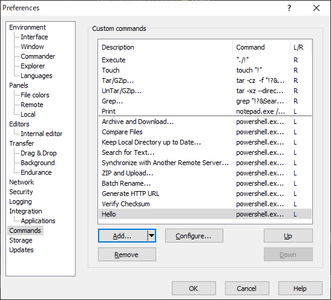

# WinScpExtension.Hello

This is a sample [**WinSCP** extension][WinSCP Extensions] for private learning purposes.

## Description

This is a simple **Windows PowerShell** script can be used as a custom command of **WinSCP**.
It says 'Hello' to person(s) or something entered in the dialog box that opens when the command is executed.
Nothing entered, it says to the world.

Yes, it's useless.

## Installation

### Prerequisites

- [**WinSCP**][WinSCP official] >= 6.1
  - might also work with earlier versions if the extension metadata modified properly.

### Download script

Download the script file `Hello.ps1` using a web browsers, git client, or any other means.

### Add extension

Launch **WinSCP** and in the GUI, select menu *Commands* > *Static Custom Commands* > *Customize...*. Then **Preferences** dialog will open.


At **Comamnd** page in **Preferences** dialog, pull down the *Add...* button and select *Add Extension...*, and **Add Extension** dialog will open.


In **Add Extension** dialog, enter the full path of `Hello.ps1` downloaded earlier,
then click the *OK* button.


If the extension was successfully added, 'Hello' appears in **Custom commands** list at **Commands** page in **Preferences** dialog.



> [!NOTE]
> When an extension is added, the original script file is copied into the predefined directory for extensions. 

## Run

In the **WinSCP** GUI, select *Commands* > *Static Custom Commands* > *Hello*.


**Hello** dialog will open.


Enter the name to hello in the textbox and click *OK*.


A Windows PowerShell window will open, and a 'Hello' message will be displayed.


To finish command and close the window, press any key as indicated on the window.

## Explanation of Imprementation

Here is the whole code of the script.

```ps1
# @name &Hello
# @description Hello to world or a designated person.
# @command powershell.exe   -ExecutionPolicy Bypass ^
#                           -File "%EXTENSION_PATH%" ^
#                           -name "%Name%" ^
#                           -pause
# @homepage https://github.com/Fukuda-Masataka/WinScpExtension.Hello
# @require WinSCP 6.1
# @option Name -run textbox "&Name:" ""
[CmdletBinding()]
param (
    [string]
    $name,
    [switch]
    $pause
)

$result = 0

try {
    if ( !$name ) {
        $name = "World"
    }
    Write-Host "Hello, $name."
}
catch {
    Write-Host "Error: $($_.Exception.Message)"
    $result = 1
}

# Pause if -pause switch was used.
if ($pause) {
    Write-Host "Press any key to exit..."
    [System.Console]::ReadKey() | Out-Null
}

exit $result
```

### Main Code

The script code itself is simple.

1. Accepts 2 arguments
    - `$name`: the name to which this script says hello. 
    - `$pause`: enables pausing at the end.

2. If `$name` is null or empty, override it with "World".

3. Display a message saying hello to `$name`.

4. Pause if `$pause` switch is enabled.

### Comment Block: Extension Metadata

The comment section at the beginning includes the extension metadata.

I've added line breaks for readability.

> A metadata line can continue on following line(s) by using ^ at the end of the line. 

Used metadata keys are listed below:

- `@name &Hello`

    Specify the name of the custom command. 
    
    The *ampersand* ('&') before 'H' makes it a keyboard accelerator.

> [!WARNING]
> It's better to append an *ellipsis* ('...') at the end of the name for this script,
> as a prompt is diplayed before this script actually works.
> 
> Yes, I should've done it. But I ended up capturing several images for this README
> without realizing it... 

- `@description ...`

    A simple description of this custom command.
    This will be shown in mouse-over popups of this command menu, etc.

- `@command ...`

    Here's again.

    ```ps1
    # @command powershell.exe   -ExecutionPolicy Bypass ^
    #                           -File "%EXTENSION_PATH%" ^
    #                           -name "%Name%" ^
    #                           -pause
    ```

    This means the custom command is executed by launching **powershell.exe** with some arguments.
    The arguments are:
    - `-ExecutionPolicy Bypass`

        See [About Execution Policy](https://learn.microsoft.com/en-us/powershell/module/microsoft.powershell.core/about/about_execution_policies?view=powershell-7.4).

    - `-File "%EXTENSION_PATH%"`

        `%EXTENSION_PATH%` will be extended by **WinSCP** to the path of this script file itself.
        So, this specifies that this script file is the file to excute for **powershell.exe**.

    - `-name "%Name%"`

        This provides the value of `"%Name%"` as an argument `$name` to the script.
        `%Name%` will be extended by **WinSCP** along with *option* metadata mentioned later.

    - `-pause`

        Enables pausing switch. The script is designed to change its behavior with this switch, but if it's not enabled, the window displaying a message closes immediately.

> [!NOTE]
> `%EXTENSION_PATH%` refers the file in the directory for extensions, not the original one.
> So calling other script files with relative paths in the extension script will fail.

- `@homepage ...`

    Specifies the URL of this extension's homepage. Not used by **WinSCP**.
    
- `@require WinSCP 6.1`

    Specifies this extension require **WinSCP** verion 6.1 or above.
    This prevents the addition of this extension into **WinSCP** which versions less than 6.1.

- `@option Name -run textbox "&Name:" ""`

    This defines an option `Name`.

    The value of this option will be the result of `%Name%` expansion and is prompted at runtime with a dialog (referred to as the **Hello** dialog). 

    The dialog contains a textbox labeled 'Name:' (*ampersand* '&' specifies a keyboard accelerator), and the input provided will be used as the value of this option. The default value of the textbox is empty (`""`).

The list of available metadata and their explanations can be found at [WinSCP Extensions][WinSCP Extensions].

## Lessons from Development

- During development, it is better to provide `-NoExit` to **powershell.exe** in `@command`.

    As the metadata is described in a comment block, defects such as unmatches between option names and script argument names cannot be easily detected.
    If there are such defects, **Windows PowerShell** reports them at runtime. ***But the window immediately closes, make it difficult to read the error messages***.

    Because the errors occur not during the script processes but during the invocation of the script, they cannot be caught as exceptions, and pausing at the end never works.

    Here's a sample:

    ```ps1
    # @command powershell.exe -NoExit -ExecutionPolicy Bypass ...
    ```

## References

- [WinSCP official][WinSCP official]
  - [Custom Command][Custom Command]
    - [WinSCP Extensions][WinSCP Extensions]

- [Powershell Documentation][Powershell Documentation]

[WinSCP official]: https://winscp.net/
[Custom Command]:  https://winscp.net/eng/docs/custom_command
[WinSCP Extensions]: https://winscp.net/eng/docs/extension

[Powershell Documentation]: https://learn.microsoft.com/en-us/powershell/?view=powershell-7.4
